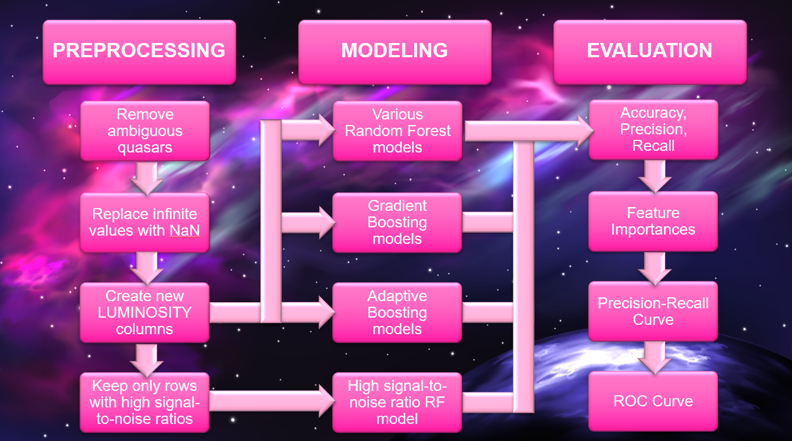
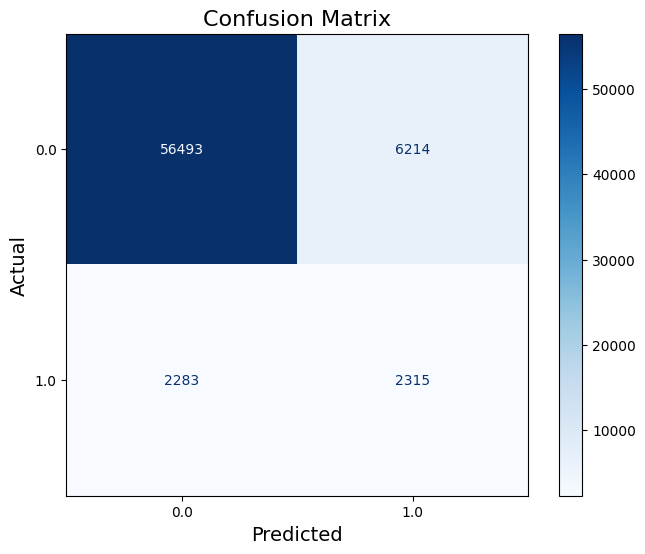
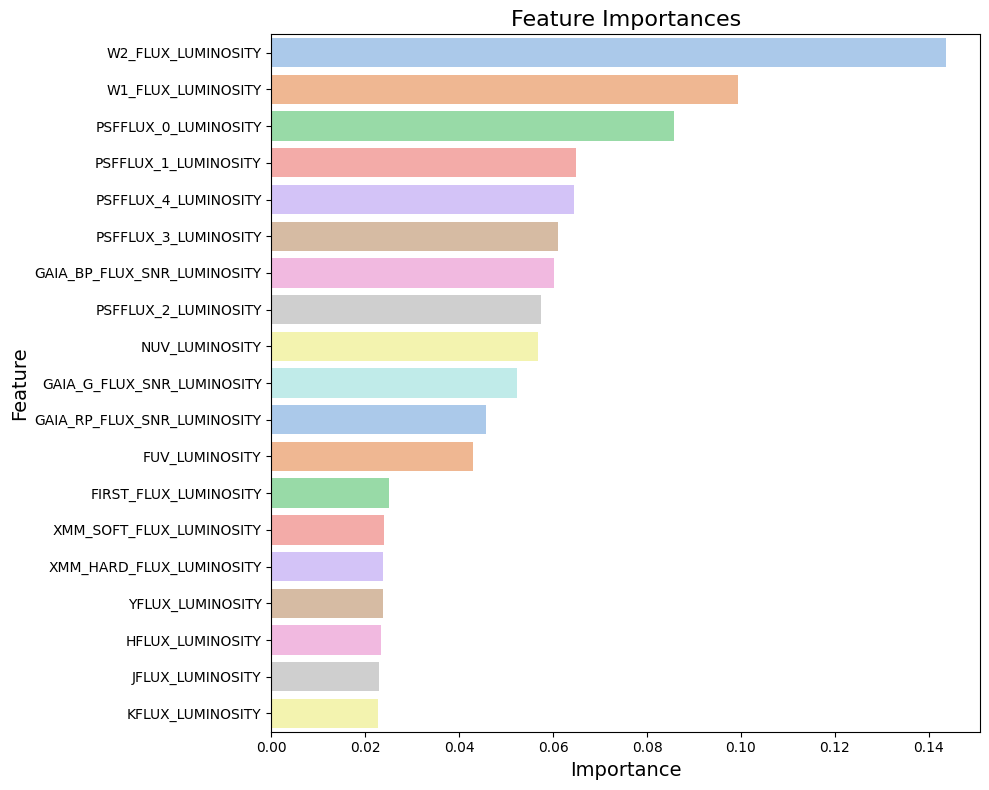
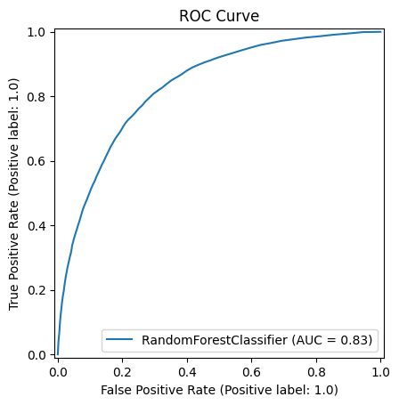

# Classifying Special Quasars

This repository is home to several machine learning models built to classify Broad Absorption Line (BAL) and double-peaked quasars, aiding astrophycisists in the exploration of quasar features and their relation to cosmological phenomena like black hole and galaxy formation.

This was a collaborative, multidisciplinary project between the fields of machine learning and astrophysics, created for a senior capstone class. The project was completed under the guidance of [Dr. Steven Fernandes, PhD](https://www.creighton.edu/campus-directory/fernandes-steven-l), [Dr. Jack Gabel, PhD](https://www.creighton.edu/campus-directory/gabel-jack-r), and [Dr. Chris Anson, PhD](https://www.creighton.edu/campus-directory/anson-christopher).

## Contents
- [Dataset](#dataset)
- [Preprocessing](#preprocessing)
-- [Converting .FITS to .csv](#converting-fits-to-csv)
-- [Feature Selection](#feature-selection)
-- [Converting Flux to Luminosity](#converting-flux-to-luminosity)
-- [Downsizing](#downsizing)
-- [KNN Imputation](#knn-imputation)
- [Modeling](#modeling)
- [Evaluation of Best Model](#evaluation-of-best-model)
-- [Precision & Recall](#precision--recall)
-- [Feature Importance](#feature-importance)
-- [ROC Curve](#roc-curve)

## Block Process Diagram

# Dataset
- **File:** 'data/Clean_Quasar_Data.csv'
- **Source:** Lyke, B. W., Higley, A. N., McLane, J. N., Schurhammer, D. P., Myers, A. D., Ross, A. J., ... & Weaver, B. A. (2020). The Sloan Digital Sky Survey Quasar Catalog: Sixteenth Data Release. The Astrophysical Journal Supplement Series, 250(1), 8.
- The original dataset contains hundreds of columns related to quasar identification, flux, magnitude, and other features.
- This dataset has been cleaned as discussed below.
- The target variable (BAL_PROB) indicates the BAL probability of each quasar.

# Preprocessing
- **Files:** 
-- *open_fits.py*
-- *preprocessing.ipynb*
-- *preprocessing_signal_to_noise.ipynb* - output used only in *random_forest_snr.ipynb*

Preprocessing complex cosmological data is no easy feat. However, the data has been previously processed by Lyke et. al. (2020), albiet for a different purpose.

### Converting .FITS to .csv
The data was also originally supplied in a multidimensional .FITS file, which requires some work to convert to a much more usable .csv:
    
    import pandas
    from astropy.io import fits

    filename = 'DR16Q_v4.fits'
    with fits.open(filename) as hdul:
        # Accesses the first extension
        hdu = hdul[1] 
        data_dict = {}

        # Loops over each field in the binary table
        for name in hdu.columns.names:
            column_data = hdu.data[name]
        
            # Tests to see of the column is multi-dimensional
            # If true, flatten the column
            if column_data.ndim > 1:
                # Flattens each row's data and stores in the dictionary
                for i in range(column_data.shape[1]):
                    data_dict[f"{name}_{i}"] = column_data[:, i]
            else:
                # If data is not multi-dimensional, stores it as normal
                data_dict[name] = column_data

        df = pandas.DataFrame(data_dict)

        # Saves the DataFrame to a CSV file
        output_filename = 'output_table.csv'
        df.to_csv(output_filename, index=False)

A few thousand 'quasars' in the dataset are, for some reason, not quasars. These are removed:

    filtered_data = data[
        (data['IS_QSO_FINAL'] == 1)
    ]

Additionally, most of the columns are unimportant for our purposes. Hundreds of columns are simply identifiers, another few dozen contain error data, another few contain flags, etc. We select only the columns we want:

    flux_cols = [
            'PSFFLUX_0', 'PSFFLUX_1', 'PSFFLUX_2', 'PSFFLUX_3', 'PSFFLUX_4',
            'FUV', 'NUV',
            'YFLUX', 'JFLUX', 'HFLUX', 'KFLUX',
            'W1_FLUX', 'W2_FLUX',
            'FIRST_FLUX',
            'XMM_SOFT_FLUX', 'XMM_HARD_FLUX',
            'GAIA_PARALLAX',
            'GAIA_G_FLUX_SNR', 'GAIA_BP_FLUX_SNR', 'GAIA_RP_FLUX_SNR'
            ]

For the purpose of creating a solid model, we want to remove any quasars that the scientists who created the original dataset were not absolutely certain were or were not BAL quasars.

    data = data[
        (data['BAL_PROB'] == 1) | (data['BAL_PROB'] == 0)
    ]

Lastly, we want to remove any dramatic outliers. Some values are recorded as -9999, impossibly large values, etc. These are inevitable in most huge datasets, and can introduce bias into models.

    for col in cols:
        Q1 = filtered_data[col].quantile(0.25)
        Q3 = filtered_data[col].quantile(0.75)
        IQR = Q3 - Q1

        lower_bound = Q1 - 7.5 * IQR
        upper_bound = Q3 + 7.5 * IQR

        filtered_data[col] = numpy.where((filtered_data[col] < lower_bound) | (filtered_data[col] > upper_bound), numpy.nan, filtered_data[col])

### Feature Selection
After experimenting with different subsets of features, it was decided that including all flux data would fit best for the model's performance. In the future, flux data should be modified with relation to z (redshift) to resolve a number closer to a quasar's true energy output.

The following columns are included in the dataset:

    'Z',
    'BAL_PROB',
    'PSFFLUX_0', 'PSFFLUX_1', 'PSFFLUX_2', 'PSFFLUX_3', 'PSFFLUX_4',
    'FUV', 'NUV',
    'YFLUX', 'JFLUX', 'HFLUX', 'KFLUX',
    'W1_FLUX', 'W2_FLUX',
    'FIRST_FLUX',
    'XMM_SOFT_FLUX', 'XMM_HARD_FLUX',
    'GAIA_PARALLAX',
    'GAIA_G_FLUX_SNR', 'GAIA_BP_FLUX_SNR', 'GAIA_RP_FLUX_SNR'

### Converting Flux to Luminosity
An important component of this dataset is measured 'redshift' in quasars. Redshift is important because it tells us how far away quasars are, which in turn tells us each quasar's *luminosity*. 

Luminosity is a more reliable measure of energy output than flux. This is because flux is the amount of energy that we *receive*, not how much energy is actually emitted. We can use each row's redshift value to convert each flux value into a luminosity value using Hubble's Law:

    # Constants
    c = 300000  # Speed of light in km/s
    H0 = 70    # Hubble constant in km/s/Mpc

    # Calculates distance in Mpc with Hubble's Law
    data['Distance_Mpc'] = (c * data['Z']) / H0  

    # Creates new _LUMINOSITY columns for each flux column
    for col in flux_cols:
        data[f'{col}_LUMINOSITY'] = 4 * numpy.pi * (data['Distance_Mpc']**2) * data[col]

### Downsizing
GitHub has a file size limit of 100MB. This means that the dataset (even the clean one) cannot be uploaded. *data/Clean_Quasar_Data.csv* is a randomized 1/4 copy of the original Clean_Quasar_Data. If you attempt to run the preprocessing files, they will not work unless you create a localdata/ file with data from the Lyke et al. (2020) paper on your own.

However, that step is not necessary to see the models in action. The dataset is still very large, even after a major downsize. Contact James Brainard (repository owner) for any inquiries about the full data.

The notebook file outputs as displayed in this repository were obtained using the full dataset.

### KNN-Imputation
There is a good deal of missing data in our columns. Rather than using simple mean imputation, we make use of the surplus of data at our disposal with KNN imputation. KNN imputation fills in missing data by using all other columns to find and use the most similar other rows (neighbors) in the dataset. This does, however, require far more excess computational power than any other method used.

    from sklearn.impute import KNNImputer
    imputer = KNNImputer(n_neighbors=5)
    X_train = imputer.fit_transform(X_train)
    X_test = imputer.transform(X_test)

# Modeling
Multiple models were used in an attempt to find the best possible solution to this classification problem. Among the models are:
- Random Forest 
-- *random_forest.ipynb*
-- *random_forest_snr.ipynb*
-- *random_forest_psfflux.iypnb*
-- *random_forest_wise.ipynb*
-- *random_forest_with_knn_imputation.ipynb*
- Gradient Boosting
-- *gradient_boosting.ipynb*
- Adaptive Boosting
-- *adaptive_boosting.ipynb*

The random forest with KNN imputation produced superior performance on every metric. Below is an evaluation of only this model. For evaluations of other models, see respective *.ipynb* files.

# Evaluation of Best Model
The model with KNN imputation is evaluated using the following statistical tools:
- **Precision & Recall**
- **Confusion Matrix**
- **ROC Curve**

### Precision & Recall
Using the RandomForestClassifier's results on testing data, we can build a confusion matrix and find the following scores:

| Class | Precision | Recall | F1-Score | Support |
|-------|-----------|--------|----------|---------|
| Non-BAL   | 0.96      | 0.90   | 0.93     | 62,707  |
| BAL   | 0.27      | 0.50   | 0.35     | 4,598   |

### Feature Importance
Using the RandomForestClassifier's built-in feature importance functions, we can rank features by their importance to the model, and visualize the result using Seaborn and Matplotlib:

### ROC Curve
Using scikit-learn's ROC curve functions, we can visualize the model's ROC curve:

# Replication (Setup & Usage)
NOTE: GitHub has a file size limit of 100MB. This means that the dataset (even the clean one) cannot be uploaded. *data/Clean_Quasar_Data.csv* is a randomized 1/4 copy of the original Clean_Quasar_Data. If you attempt to run the preprocessing files, they will not work unless you create a localdata/ file with data from the Lyke et al. (2020) paper on your own. 

However, that step is not necessary to see the models in action. The dataset is still very large, even after a major downsize. Contact James Brainard (repository owner) for any inquiries about the full data.

1. Clone this repository:

        git clone https://github.com/jamesbrainard/quasars.git
        cd quasars

2. Install the necessary dependencies (optionally, create a new environment beforehand):

        pip install -r requirements.txt

3. Use the *.ipynb* files as desired to recreate the data.